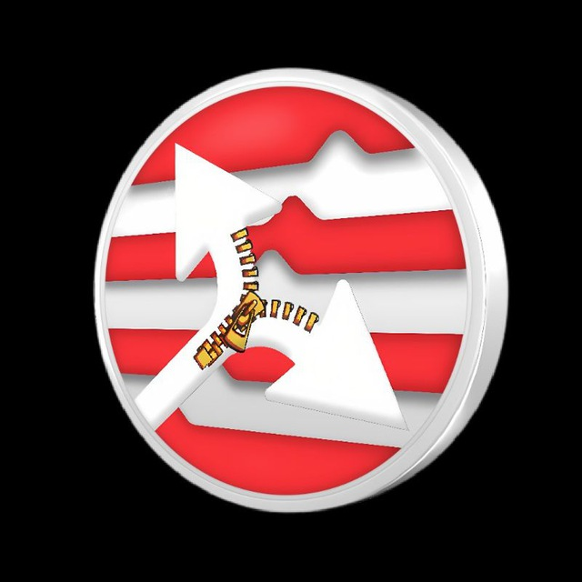

## About Us

**Ziptos** is an innovative suite of tools and solutions built on the Aptos blockchain and the most usable, accessible blockchain app called Telegram

Ziptos has four tools which are live. They can be accessed using these links [Ziployer](https://t.me/ZiptosBot) [Zipdrip](https://t.me/ZiptosAirdropBot) [Ziploc](https://t.me/ZiptosLockerBot) [ZiptosWallet](https://t.me/ZiptosWalletBot). Currently our tools are compatible with [Aptos](https://aptoslabs.com/) blockchain.

## Background

The Ziptos ecosystem not only simplifies blockchain interactions but also drives adoption and innovation. By providing tools and features that lower the barrier to entry, it empowers more people to participate in the blockchain revolution and join the next potential boom chain [Aptos](https://aptoslabs.com/). 

## Socials

## License

Ziptos is released under the open source [Apache License](LICENSE). If you utilize Ziptos, kindly acknowledge it within your product and provide a link to [Ziptos On Aptos](https://t.me/ZiptosOnAptos).
